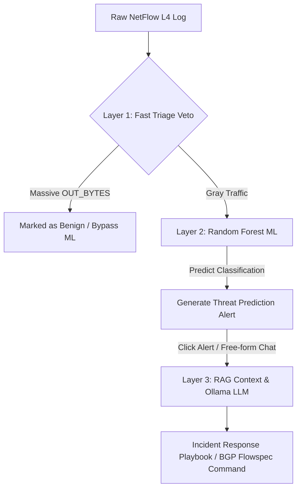

# Unified Threat Detection (NetFlow L4 Analytics)

[](https://www.python.org/)
[](https://www.docker.com/)
[](https://streamlit.io/)
[](https://scikit-learn.org/)
[](https://ollama.com/)

**Unified Threat Detection (NetFlow L4 Analytics)** adalah platform pemantauan keamanan jaringan *hybrid* enterprise yang beroperasi pada L3/L4 OSI layer. Sistem ini didesain secara khusus untuk mendeteksi ancaman keamanan tingkat tinggi seperti **DDoS Flood**, **Brute Force**, dan **Port Scanning** langsung di level *Edge Router* secara *real-time*. Dengan bertindak sebagai pos pemeriksaan terdepan, sistem ini mampu melakukan mitigasi dini dan memotong lalu lintas berbahaya sebelum mencapai dan membebani server aplikasi hilir atau komponen Web Application Firewall (WAF) L7 yang lebih mahal secara komputasi. Mengusung prinsip **"Anti-Gravity"**, proyek ini dirancang murni menggunakan *pure Python stack*, mengutamakan performa tinggi tanpa dependensi berlebih, serta mengadopsi arsitektur kontainer penuh (*fully containerized*) untuk kemudahan deployment.

---

## 📊 System Architecture & Hybrid Flow

Sistem ini mengimplementasikan **3-Layer Hybrid Pipeline Architecture** yang menggabungkan efisiensi aturan statis (*rule-based*), kecerdasan statistik *Machine Learning*, dan penalaran kontekstual *Generative AI*:



### 🔹 Layer 1: Fast Triage (Rule-Based Veto)
Mekanisme pertahanan lini pertama yang beroperasi dengan latensi $0\text{ ms}$ menggunakan metode *Forward Chaining*. Layer ini dirancang khusus untuk memotong jalur evaluasi data yang memiliki volume unduhan keluar sangat besar (`OUT_BYTES` masif, `IN_BYTES` rendah). Lalu lintas dengan pola ini langsung dilabeli sebagai **Benign** (sah) dan mem-bypass proses evaluasi Machine Learning. Pendekatan ini secara signifikan menekan angka *False Positive Rate* (FPR) pada aktivitas transfer file besar yang sah sekaligus meminimalkan konsumsi daya komputasi.

### 🔹 Layer 2: Analytics Layer (Traditional Machine Learning)
Lalu lintas "abu-abu" yang lolos dari Layer 1 akan dievaluasi oleh model **Random Forest Classifier** yang disimpan dalam format `.joblib`. Model ini dilatih menggunakan dataset telemetri jaringan sebanyak 400.000 baris. Guna menghindari masalah kebingungan fitur (*Feature Ambiguity*) dan kolinearitas tinggi antara DDoS dan Port Scanning (yang kerap berbagi nilai TCP Flags = 2 dan byte masuk rendah pada log NetFlow tunggal), kami menerapkan metode **Adversarial Noise Injection** sebesar 10% pada fitur volume paket (`IN_PKTS`) saat pembuatan dataset latih. Hal ini memaksa model ML untuk membagi keputusan secara akurat berdasarkan intensitas volumetrik paket.

### 🔹 Layer 3: GenAI Interpreter Agent (Local LLM via Ollama)
Untuk mempermudah pengambilan keputusan oleh tim Security Operations Center (SOC) L1, platform ini mengintegrasikan agen AI lokal berbasis **Ollama API** (`http://host.docker.internal:11434`) menggunakan model **`qwen2.5:3b`** (dengan fallback otomatis ke **`gemma2:2b`**). Agen ini mengonsumsi context log NetFlow anomali (RAG) secara *real-time* dan merumuskan draf Laporan Analisis Insiden serta rekomendasi perintah mitigasi **BGP Flowspec** menggunakan Bahasa Indonesia yang formal dan taktis.

---

## 🗂️ Repository Structure

Struktur direktori proyek dirancang modular untuk memisahkan logika pemrosesan data belakang (*backend*) dengan antarmuka pengguna (*frontend*):

```directory
unified-threat-detection/
├── backend/
│   ├── Dockerfile            # Spesifikasi kontainer backend data/ML engine
│   ├── generator.py          # Skrip generator dataset tiruan NetFlow 500k baris (.parquet)
│   ├── engine.py             # Logika latih Random Forest, veto rules, & evaluasi model (.joblib)
│   └── validator.py          # Utilitas CLI interaktif untuk manual stress-testing model
├── frontend/
│   ├── Dockerfile            # Spesifikasi kontainer aplikasi Streamlit
│   └── app.py                # Dashboard SOC Streamlit multi-tab, dataframe klik, & RAG Chatbot
├── data/                     # Volume bersama untuk dataset NetFlow Parquet (live.parquet)
├── models/                   # Volume bersama untuk ekspor model joblib (netflow_rf_model.joblib)
├── docker-compose.yml        # Orkestrasi multi-container Docker Compose
├── requirements.txt          # Daftar dependensi package Python utama
└── README.md                 # Dokumentasi utama repositori
```

---

## 💻 Host Prerequisites & Preparation

Sebelum melakukan deployment kontainer, pastikan sistem host Anda memenuhi kualifikasi berikut:

1. **Sistem Operasi**: Windows 10/11 dengan **WSL2** backend (distribusi Ubuntu Linux direkomendasikan) atau sistem operasi Linux Native.
2. **Container Engine**: Docker Desktop (WSL2-based engine aktif) atau Docker Engine bare-metal terinstal di host.
3. **Local LLM Engine**: **Ollama** harus terpasang langsung di Host OS (Windows/WSL2 bare-metal) untuk memaksimalkan performa akselerasi GPU lokal.
4. **Persiapan Model**: Pastikan port `11434` terbuka dan jalankan perintah penarikan model berikut di terminal host Anda:
   ```bash
   ollama pull qwen2.5:3b
   ollama pull gemma2:2b
   ```

---

## 🚀 Step-by-Step Deployment Guide

Ikuti panduan perintah terminal berikut secara berurutan untuk menjalankan seluruh ekosistem aplikasi:

### Langkah 1: Kloning Repositori & Navigasi Direktori
Kloning repositori proyek dari GitHub ke dalam lingkungan WSL2/Linux Anda, lalu masuk ke folder root proyek:
```bash
git clone https://github.com/username/unified-threat-detection.git
cd unified-threat-detection
```

### Langkah 2: Membuka Koneksi Host Ollama
Pastikan daemon Ollama di host Anda menyala dan siap menerima request eksternal dari Docker container. Secara default pada Windows, Ollama berjalan di latar belakang pada alamat `http://localhost:11434`.

### Langkah 3: Kompilasi & Jalankan Multi-Container
Jalankan orkestrasi Docker Compose untuk membangun (*build*) image kontainer frontend, backend, dan local database volume secara *air-gapped*:
```bash
docker compose up --build -d
```

### Langkah 4: Eksekusi Data Generation & ML Training Pipeline
Karena database dan model memerlukan bobot awal, jalankan skrip backend generator data dan training ML secara berurutan di dalam kontainer `netflow_backend_engine`:
```bash
# 1. Jalankan generator untuk membuat 500.000 log telemetri NetFlow Parquet
docker exec -it netflow_backend_engine python3 generator.py

# 2. Jalankan engine untuk melatih model Random Forest & mengekspor file .joblib
docker exec -it netflow_backend_engine python3 engine.py
```

### Langkah 5: Mengakses Antarmuka Dashboard
Setelah pipeline selesai dieksekusi, buka browser web Anda dan akses antarmuka dashboard monitoring SOC pada tautan berikut:
* **Streamlit Web UI**: [http://localhost:8501](http://localhost:8501)

---

## 🎨 Feature & Dashboard Showcase

Dashboard Streamlit dibagi menjadi 2 Tab Utama dengan visualisasi kelas enterprise:

### 📊 Tab 1: Live Security Dashboard
* **Metrics Panel**: Menyajikan 4 metrik utama yaitu:
  1. *Total Active Flows* (Jumlah seluruh koneksi NetFlow terdeteksi).
  2. *Total Threats Detected* (Jumlah serangan DDoS, Brute Force, dan Port Scanning).
  3. *Triage Bypass Efficiency* (Persentase penghematan beban kerja berkat veto bypass Layer 1).
  4. *Analyst Saved Time*: Indikator performa efisiensi analis SOC yang dihitung dengan rumus:
     $$\text{Saved Time (Hours)} = \frac{\text{Total Attacks} \times 5\text{ seconds}}{3600}$$
* **Threat Distribution Chart**: Donut chart interaktif yang menampilkan proporsi klasifikasi lalu lintas.
* **Alert Feed Queue Table**: Tabel data telemetri aktif yang responsif terhadap klik baris (*selection-aware dataframe*). Memiliki **Conditional Formatting** warna baris sesuai tingkat ancaman:
  * 🔴 **Merah**: DDoS Flood
  * 🟠 **Oranye**: Brute Force
  * 🟡 **Kuning**: Port Scanning
* **GenAI Incident Playbook Generator**: Menampilkan visualisasi rencana mitigasi taktis insiden secara streaming saat baris anomali pada tabel log diklik oleh analis.

### 💬 Tab 2: AI Security Assistant Chatbot
* **Hybrid Message Router**:
  * **Strict Commands**: Menjaga efisiensi dengan mencocokkan pola perintah ber-anchor awal/akhir baris (`^` dan `$`). Perintah kaku seperti `cari [IP]`, `ip [IP]`, atau `tampilkan [N] ddos` akan dieksekusi **instan (0 latensi)** langsung melalui internal Pandas query tanpa memanggil LLM.
  * **RAG Context Injection**: Pertanyaan bebas analitis (seperti: *"Jelaskan mengapa IP 185.220.101.4 berbahaya?"*) akan secara otomatis memicu ekstraktor IP. Informasi profil statistik IP bersangkutan dan rincian 5 log terakhir akan diekstrak oleh Pandas, dikemas menjadi basis fakta data, disuntikkan ke dalam *System Prompt*, lalu ditembakkan secara *streaming* menuju local Ollama API.

---

## 🔒 Constraints & Data Privacy Policy

Platform ini mematuhi standar kedaulatan data tingkat tinggi (**Data Privacy & Air-Gapped Compliance**):
* **No External Data Leakage**: Seluruh data NetFlow, alamat IP internal organisasi, port protokol, dan metadata anomali diproses **100% secara lokal** di dalam kontainer Docker Anda dan engine Ollama internal host komputer.
* **Zero Third-Party Call**: Sistem ini tidak mengirimkan satu byte pun data organisasi keluar dari perimeter jaringan Anda (bebas dari pemanggilan API luar seperti OpenAI, Anthropic, atau Cloud LLM lainnya). Hal ini menjamin kepatuhan penuh terhadap regulasi keamanan data sensitif perusahaan/negara.

---
*Proyek UAS - Sistem Deteksi Ancaman Jaringan Terintegrasi L4 Analytics.*
